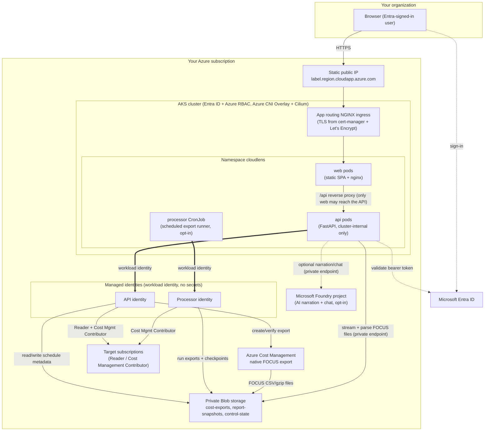

# CloudLens

**CloudLens** is a self-hosted Azure cost-assessment and FinOps dashboard. It turns native Azure Cost Management FOCUS exports into an executive-ready cost report, a rolling cost history (3–6 closed months plus the current month through yesterday), resource-level optimization recommendations, and an optional AI narrative — all running on your own infrastructure, in your own Azure subscription, under your own identity.

You deploy it once into a subscription of your choice, grant it three read/cost-management role assignments on the subscriptions you want it to analyze, and it takes care of the rest: creating the native cost exports, scheduling the rolling monthly and daily pulls, and rendering the dashboards below.

> This is a reference deployment intended for a single organization/tenant to run for itself. It is not a multi-tenant SaaS product — every deployment is isolated to the Azure subscription it's installed into.

> This is the **AKS + Terraform** variant of CloudLens (branch `cloudlensdev`): the app runs on Azure Kubernetes Service and its infrastructure is provisioned with Terraform. The `main` branch deploys the same app to Azure Container Apps with Bicep.

## Contents

- [What it does](#what-it-does)
- [Architecture](#architecture)
- [System design](#system-design)
- [Dashboards and tabs](#dashboards-and-tabs)
- [Prerequisites](#prerequisites)
- [Deploying to Azure](#deploying-to-azure)
- [The three manual role assignments](#the-three-manual-role-assignments)
- [Running on AKS](#running-on-aks)
- [Local development](#local-development)
- [Security notes](#security-notes)

## What it does

- **Reads, never writes billing data.** All cost figures come from Azure's own native FOCUS 1.2-preview cost export — the same export format used by FinOps toolkit customers — so the numbers reconcile with your Azure invoice.
- **Sets itself up.** Once the required roles are visible to its managed identity, the app creates the native exports (closed months plus a daily month-to-date export) and a rolling schedule of 3–6 months; you do not hand-configure Cost Management exports yourself.
- **Assesses resources, not just spend.** It cross-references billed cost with resource inventory, Azure Advisor, Azure Monitor metrics, and SQL/compute/storage/network signals to flag idle and overprovisioned resources.
- **Explains itself.** An optional Microsoft Foundry-backed agent turns the reconciled findings into a written executive summary and answers follow-up questions in a chat panel — this stays off until you explicitly enable it.
- **Stays inside your tenant.** Authentication is delegated Microsoft Entra ID sign-in; the API validates a bearer token issued for itself. The browser never receives an Azure Resource Manager token, and the app never requests Entra admin consent.

## Architecture



**Deployable profiles.** The Terraform configuration in [infra/](infra) is additive across three profiles, so you only provision what you plan to use:

| Profile | Adds | Use it when |
| --- | --- | --- |
| `core` | Network, AKS cluster (system and application node pools), container registry, logging, static ingress IP, the API identities | You just want the foundation up, or you're not ready to run exports yet |
| `data` | Private, key-less Blob storage behind a private endpoint, retention rules, container-scoped data roles, the processor identity | You want the app to create exports and run the rolling monthly and daily pulls |
| `ai` | A private Foundry account/project and model deployments | You want the executive-summary narrative and the Chat tab |

Each profile is a superset of the previous one. Lowering an environment's profile is refused, because Terraform would delete the storage or Foundry resources the higher profile created. `azd deploy` builds and runs both containers in every profile; the AI runtime and the scheduled processor stay off until you explicitly enable them, even after the underlying infrastructure exists.

## System design

**Identity and authorization.** The single-page app requests only its own API's `access_as_user` delegated scope from Entra ID — never an Azure Resource Manager scope. The API independently validates that bearer token's issuer, audience, tenant, and client before trusting it. Azure-side calls (discovering subscriptions, reading resources, creating exports) are made with the API's own **user-assigned managed identity** via `ManagedIdentityCredential` (workload identity on AKS), then filtered against the signed-in user's own Azure RBAC role on each subscription — so a user only ever sees subscriptions they themselves have access to, not everything the identity can reach.

**Export creation and scheduling.** Once a target subscription's Reader and Cost Management Contributor grants are visible to the API identity, opening **Schedules** automatically creates two native FOCUS exports (CSV/gzip, partitioned, overwrite-enabled) in the deployment's own storage account — closed months under `cost-exports/focus/` and daily month-to-date snapshots under `cost-exports/focus-daily/` — and saves an active schedule — no manual export configuration step is required. Each schedule keeps 3–6 closed months of history (default 6; anomaly detection needs at least 60 days). **Export** re-pulls that whole window. On the schedule's monthly day the worker pulls only closed months that have no copy taken after Azure finalized them (Azure adds late charges for up to 72 hours after a month ends), which is normally just the month that closed. Every day after the schedule's UTC daily-pull time it also pulls the current month through yesterday, plus last month during the first five days. A separate **processor** identity (kept intentionally distinct from the API identity) runs these export executions from a Kubernetes CronJob every 5 minutes (`APP_PROCESSOR_CRON`), checkpointing progress per subscription so a restart or a missed tick doesn't re-run months that already succeeded. A month that finishes is followed by the next one in the same tick; throttled requests wait as long as Azure asks (1–15 minutes) without counting as failures, and `APP_EXPORT_PARALLEL_MONTHS` (default 1) sets how many months run at once.

**Retention.** Storage lifecycle rules delete daily snapshots after 60 days (`APP_DAILY_EXPORT_RETENTION_DAYS`) and closed-month files after 214 days (`APP_CLOSED_MONTH_RETENTION_DAYS`, at least 190 so the longest 6-month window is always covered). Reports read history from the files that remain: the month to date appears in daily views as an estimate and is left out of monthly totals until the month closes.

**Report generation.** The API streams each month's compressed FOCUS CSV directly from ADLS, validates its schema and row shape against the delivery manifest, and reconciles it with a live resource inventory, Azure Advisor recommendations, and (where enabled) Azure Monitor metrics before rendering the dashboards below.

**Foundry AI (optional).** The `ai` profile provisions a private Foundry account/project. `APP_ENABLE_CHAT_RUNTIME=true` uses that app's own approved `model-router` deployment to narrate grounded Chat answers from deterministic API and FOCUS evidence; amounts and rankings remain application-computed. The separate `APP_ENABLE_AI_RUNTIME` switch controls only the hosted-agent Executive Summary narrator. Either path can fall back without blocking the dashboard.

**No silent write access.** The app's managed identities only ever hold Reader and Cost Management Contributor roles that you grant explicitly (see below). It has no ability to modify budgets, resources, or IAM outside of the one disclosed, narrowly-scoped side effect of creating its own cost export.

## Dashboards and tabs

The app has three top-level views — **Report**, **Chat**, and **Schedules** — reachable from the top navigation bar. **Report** has a left navigation rail fixed beneath the app header: it stays in place while the report scrolls and runs from just below the logo to the bottom of the window. Every area starts open (a closed area stays closed until its own page opens), **Find a page** searches every page by name or area, and the rail collapses to icons (remembered between visits). Below 900px it becomes one **Report pages** menu above the report. The grouped pages are:

| Group | Pages | What you'll find there |
| --- | --- | --- |
| **Dashboard** | Executive Summary | The narrated (or plain, if AI is disabled) top-line summary: total spend, trend, and the highest-priority findings across the whole assessment. |
| **Cost Management** | Subscription Breakdown, History, Cost by Hour, Cost by Tags, EA Pricing, Rate Optimization, Cost Anomalies, Budgets | Where the money actually went: cost split by subscription, historical trend, hourly granularity, tag-based cost attribution, EA/negotiated pricing context, Reservation/Savings Plan coverage, anomaly detection against expected spend, and budget tracking. |
| **Resources** | Stale Resources, Governance & Risk | Inventory-driven findings: unattached disks, stopped VMs, idle gateways, orphaned NICs, and similar candidates for cleanup, plus governance/policy and tagging risk signals. |
| **Analytics** | Advisor Reconciliation | Cross-checks the app's own findings against Azure Advisor's own recommendations, so you can see where the two agree (or don't) and why. |
| **Recommendations** | Savings Roadmap, Compute Optimization, Storage Optimization, Network Optimization, Azure SQL Optimization, AI Optimization | Domain-specific rightsizing and elimination recommendations, each backed by either verified billed cost, Advisor's own estimate, or Azure Monitor-verified idle metrics — the evidence type is always shown next to the number. |
| **Reports** | Action Plan | A consolidated, exportable list of every recommended action across all domains, prioritized and ready to hand to whoever owns remediation. |

The **Executive Summary** keeps monthly headline metrics separate from the selected-period comparison. **Spend Distribution** shows the monthly trend, subscription treemap and regional map together, with subscription drilldown available directly. **Operational signals**, **Top Azure services** and **Prioritised findings** are visible front-page sections, not disclosures. The resource-type donut and anomaly preview are omitted; the dedicated **Cost Anomalies** page remains available. **Daily subscription amounts** starts expanded on this page, with each subscription's ID beneath its name. Selecting a day reveals its resource detail in Cost Comparison. Report context remains available without repeating the headline figures; the separate **Report details** disclosure has been removed.

The shared presentation finish lives in `web/src/polish.css`: layered surfaces, quiet structural borders, consistent segmented controls and navigation, and stronger headline figures. Tables share compact rows, sticky headers and row highlighting; the Executive Summary budget table can be searched and filtered by status, and flags budgets still within limit that Azure forecasts to overrun. It uses the existing brand and theme tokens, supports both density settings, and respects reduced motion and touch targets without changing report calculations.

The landing page follows a single layout rhythm: overview, comparison, distribution, evidence, budgets and daily detail. The overview combines selected-period spend, previous-period spend, assessed-month wastage, assessed-month savings and cost spikes into five financial cards; the comparison chart does not repeat them. Period figures follow the filters, with assessed-month context shown when the selection differs. Services sit beside a compact signals/findings stack on wide screens; populated findings tables receive the full width. All sections share aligned headers and gutters, and the layout stacks on smaller screens.

Comparison-chart dots show the subscription, selected and previous dates/costs, and absolute change on hover or keyboard focus. Escape dismisses the tooltip; clicking or pressing Enter/Space still opens the selected day's detail where available. Missing previous evidence stays explicitly unavailable.

Two other top-level views round out the app:

- **Chat** — ask follow-up questions about the current report in natural language (enabled by the `ai` profile and `APP_ENABLE_CHAT_RUNTIME=true`).
- **Schedules** — see per-subscription export/schedule status, trigger the automatic setup described above, and pause, resume, or manually run a subscription's monthly cycle.

## Prerequisites

**Tools** on the machine you deploy from — no local Docker is needed, the images are built in Azure Container Registry:

- [git](https://git-scm.com/) and **PowerShell 7+** (`pwsh`); the deployment hook and helper scripts are PowerShell.
- The [Azure CLI](https://learn.microsoft.com/cli/azure/), signed in with `az login`. Terraform authenticates through it, not through azd.
- The [Azure Developer CLI](https://learn.microsoft.com/azure/developer/azure-developer-cli/) 1.32 or later.
- [Terraform](https://developer.hashicorp.com/terraform/install) 1.9 or later (for example `winget install Hashicorp.Terraform`).
- **kubectl** and **kubelogin**. `az aks install-cli` installs both; the one-command script offers to run it for you.

**Permissions.** Owner (or Contributor plus User Access Administrator) on the subscription you deploy into: Terraform creates role assignments for the app's identities and makes you an administrator of the new cluster. The three per-subscription role assignments described [below](#the-three-manual-role-assignments) need Owner or User Access Administrator on each subscription you assess.

**vCPU quota.** The default node pools use Ddsv5 virtual machines: two `Standard_D2ds_v5` system nodes and two `Standard_D4ds_v5` application nodes — 12 vCPUs of the *Standard DDSv5 Family* quota, growing to 26 at the autoscaler maximum. Check with `az vm list-usage --location centralindia --output table`, or pick other sizes (see [Settings](#settings)).

**Resource providers.** The first `azd provision` registers the resource providers this deployment needs, including the [`Microsoft.CostManagementExports` resource provider](https://learn.microsoft.com/azure/azure-resource-manager/management/resource-providers-and-types) that Azure Cost Management uses to reach the export destination storage account. Registering requires **Contributor** or **Owner** on the subscription. If your account can't register providers, have an administrator run this once, before your first deployment:

```powershell
az provider register --namespace Microsoft.CostManagementExports --subscription <subscription-id>
```

Registration usually completes in under a minute. Confirm it reports `Registered`:

```powershell
az provider show --namespace Microsoft.CostManagementExports --subscription <subscription-id> --query registrationState -o tsv
```

**Register the subscription that hosts the export destination storage account** — that is, the subscription you deploy this app into. The subscriptions you only *assess* do not need it, so a deployment can happily export cost data for an unregistered subscription as long as its own storage account lives in a registered one.

> Creating an export in the Azure portal registers this provider for you automatically, but CloudLens creates its export through the [Cost Management REST API](https://learn.microsoft.com/rest/api/cost-management/exports/create-or-update), which does not. If the provider is missing, Azure rejects the export-creation call with `400 Bad Request`, the **Schedules** tab shows **Export status unavailable** with *"FOCUS export configuration could not be confirmed"*, and no export is ever created — regardless of how correct your role assignments and storage firewall settings are. Registering the provider and then using **Refresh schedules** resolves it; nothing needs redeploying.

## Deploying to Azure

There are two ways to deploy: one command that does the whole thing, or the step-by-step Azure Developer CLI workflow. Both use [azure.yaml](azure.yaml), and one `azd up` does all of this:

1. **`azd provision` runs Terraform** ([infra/](infra)): resource group, network, AKS cluster, container registry, Log Analytics, managed identities with their workload-identity federation, and — per profile — the export storage and the Foundry account. Terraform state is kept in `.azure/<environment>/infra/`.
2. **The postprovision hook** ([scripts/aks-bootstrap.ps1](scripts/aks-bootstrap.ps1)) prepares the cluster: it installs a pinned, checksum-verified cert-manager release, creates an app-routing NGINX ingress controller on the Terraform-owned static IP, and adds the Let's Encrypt issuers. It is safe to rerun.
3. **`azd deploy`** builds both container images remotely in Azure Container Registry, then applies [api/manifests](api/manifests) and [web/manifests](web/manifests) to the `cloudlens` namespace and waits for the rollout.
4. **cert-manager** obtains the Let's Encrypt certificate for the app's host name, usually within a minute or two, and renews it automatically.

The app is then served at `https://<label>.<region>.cloudapp.azure.com` (the `APP_WEB_ORIGIN` value in the azd environment), or at your own domain once you [add one](#https-and-custom-domains).

### Option 1 — One command, end to end (recommended)

`scripts/deploy-end-to-end.ps1` is this entire page in a single self-contained script: prerequisites, sign-in, environment settings, the Terraform preview, `azd up` with automatic retries, `bootstrap-identity.ps1` plus the client-ID rollout, and the three role assignments on every subscription you name. When it finishes, the app is deployed, sign-in works, and the subscriptions you listed are ready to assess — no manual follow-up steps.

```powershell
git clone --branch cloudlensdev https://github.com/Saby007/CloudLens.git
cd CloudLens
azd auth login
az login
pwsh ./scripts/deploy-end-to-end.ps1 `
  -EnvironmentName my-environment `
  -Location centralindia `
  -TargetSubscriptionId '<subscription-id>,<another-subscription-id>'
```

`-TargetSubscriptionId` takes a comma-separated list (or several values) so one run can grant access to every subscription you want to assess; omit it and only the subscription you deploy into is granted. The deployment subscription itself defaults to the Azure CLI's current one — pass `-SubscriptionId` to deploy somewhere else. The script pins that subscription into the azd environment and into every `az` lookup, so no step stops to prompt you halfway through a long run.

**Expect the first run to take roughly 30–45 minutes** — creating the cluster alone takes 10–15 minutes. A failed `azd up` or `azd deploy` is retried after a wait (`-MaxAttempts`, default 3). The usual reasons on a brand-new environment are a role assignment that hasn't reached Azure or the cluster yet, or Azure still finishing an earlier operation on the cluster or the Foundry account; warnings about them are normal progress, not failures. Every phase is idempotent, so a run that stops partway can simply be rerun — it reapplies the current code once and skips whatever is already in place.

**The run never waits on a question you can't see.** Every `azd` command runs with `--no-prompt`, so a new environment is created and becomes the folder's default azd environment without asking. If `azd` still needs an answer, the script reruns that command in the terminal so you can answer it. If kubectl or kubelogin is missing, or your tenant requires a Service Tree ID on the sign-in app registrations, the script asks there too.

| Switch | Use it when |
| --- | --- |
| `-PlanOnly` | Print exactly what would happen without touching Azure. |
| `-SubscriptionId` | Deploy into a subscription other than the Azure CLI's current one. |
| `-MaxAttempts` | Allow more retries (default 3). |
| `-InstallKubernetesTools` | Install kubectl and kubelogin with `az aks install-cli` without asking. |
| `-AcmeEmail` | Register a contact address with Let's Encrypt for the TLS certificate. |
| `-SkipIdentityBootstrap` | A separate Entra administrator creates the app registrations. |
| `-ServiceManagementReference` | Your tenant requires a Service Tree ID on app registrations. If you leave it out, the script asks when the tenant refuses, suggests the ID your existing registrations use, and remembers your answer. |
| `-SkipRoleAssignments` | A subscription Owner grants the three roles separately. |
| `-SkipProcessor` | Scheduled exports are intentionally out of scope (the processor setting is left as it is). |
| `-SkipPreview` | Skip `azd provision --preview` (the Terraform plan) on a rerun you have already reviewed. |

### Option 2 — Azure Developer CLI, step by step

Use this when you want to drive each stage yourself. Clone the `cloudlensdev` branch first — `azd` reads `azure.yaml`/`infra/`/`api/`/`web/` from your local copy:

```powershell
git clone --branch cloudlensdev https://github.com/Saby007/CloudLens.git
cd CloudLens
azd auth login
az login
pwsh ./scripts/deploy-ai.ps1 -EnvironmentName my-environment -Location centralindia
```

The helper is Option 1 without its sign-in and role-assignment phases: it checks the tools, applies the recommended `ai` profile with the app-local Model Router and the scheduled processor, previews the Terraform plan, and runs `azd up` with the same retries. You then do [step 4 (sign-in)](#4-configure-sign-in) and [step 5 (role assignments)](#5-grant-access-to-the-subscriptions-you-want-to-assess) yourself.

The equivalent raw commands are:

```powershell
$modelRouter = '[{"name":"model-router","modelFormat":"OpenAI","modelName":"model-router","modelVersion":"2025-11-18","sku":"GlobalStandard","capacity":20}]'

azd env new my-environment --location centralindia
azd env set APP_PROFILE ai
azd env set APP_EXPORT_TRUSTED_SERVICES true
azd env set APP_MODEL_DEPLOYMENTS $modelRouter
azd env set MODEL_ROUTER_DEPLOYMENT_NAME model-router
azd env set APP_ENABLE_CHAT_RUNTIME true
azd env set APP_AI_VALIDATED true
azd env set APP_ENABLE_AI_RUNTIME false
azd env set APP_ENABLE_PROCESSOR true
azd provision --preview
azd up
```

Boolean settings must be lowercase `true` or `false`. Re-running `azd up` (or `azd deploy` alone, for code changes) later updates the deployment in place.

If you intentionally want exports without Foundry chat, set `APP_PROFILE=data` and omit the five Model Router/chat settings. That is an opt-out path, not the recommended deployment.

For both `data` and `ai`, keep `APP_EXPORT_TRUSTED_SERVICES=true` — otherwise the storage account's network rules keep `bypass` at `None`, which blocks Cost Management's export-creation call (the Schedules tab always shows **Export status unavailable**, regardless of subscription type or RBAC grants, until this is set).

> This grants Azure's own "trusted Microsoft services" exception (`Microsoft.CostManagementExports`) on the storage account's firewall — it's scoped to first-party Azure services, not a public network opening, and is required for native FOCUS exports to reach a firewalled/private-endpoint-only storage account at all. In tenants with central governance policies (for example `StorageAccount_PublicNetwork_Modify`), `publicNetworkAccess` may still end up `Disabled` regardless of `APP_EXPORT_TRUSTED_SERVICES` — that's expected and fine; the `AzureServices` bypass is what actually matters.

> If `azd up`/`azd provision` crashes with a Go panic mentioning `HooksMiddleware`, that's a known `azd` bug ([azure-dev#10037](https://github.com/Azure/azure-dev/issues/10037)) unrelated to this repo — upgrade `azd` (`azd version` to check, then reinstall the latest).

### Then, for Option 2

> Option 1 already did both of these steps for you. Continue here only if you deployed with Option 2.

#### 4. Configure sign-in

This step creates two Microsoft Entra ID app registrations: a **public-client SPA** (what users sign into in the browser) and a **confidential-client API** (what validates their token). `scripts/bootstrap-identity.ps1` creates both for you — redirect URI, API scope, and the federated credential the API's managed identity needs — instead of you clicking through the Entra portal by hand.

> [`scripts/deploy-end-to-end.ps1`](#option-1--one-command-end-to-end-recommended) runs this entire step for you, including feeding the two client IDs back into `azd` and redeploying. Follow the manual steps below when you want to review the plan first, or when a separate Entra administrator runs the bootstrap.

> Run this with **PowerShell 7+** (`pwsh`), not Windows PowerShell 5.1 — the `-Apply` path uses `ConvertFrom-Json -AsHashtable`, which doesn't exist in 5.1. If you're on Windows and typed `./scripts/bootstrap-identity.ps1` directly, check `$PSVersionTable.PSVersion` first; if it's below 7, launch `pwsh` and run the command again from there.

**Gather the values the script needs.** If you deployed with `azd`, load them straight into PowerShell variables with `azd env get-value` (the singular form — it prints one raw, unquoted value per call, so it's safe to assign directly; the plural `azd env get-values` only *prints* everything to the terminal, it does **not** create variables for you):

```powershell
$AZURE_TENANT_ID = azd env get-value AZURE_TENANT_ID
$AZURE_SUBSCRIPTION_ID = azd env get-value AZURE_SUBSCRIPTION_ID
$AZURE_ENV_NAME = azd env get-value AZURE_ENV_NAME
$APP_WEB_ORIGIN = azd env get-value APP_WEB_ORIGIN
$MEGHKOSHA_OBO_MANAGED_IDENTITY_RESOURCE_ID = azd env get-value MEGHKOSHA_OBO_MANAGED_IDENTITY_RESOURCE_ID
```

**Preview first — this is always safe and creates nothing:**

```powershell
./scripts/bootstrap-identity.ps1 `
  -TenantId $AZURE_TENANT_ID `
  -SubscriptionId $AZURE_SUBSCRIPTION_ID `
  -EnvironmentName $AZURE_ENV_NAME `
  -WebOrigin $APP_WEB_ORIGIN `
  -OboManagedIdentityResourceId $MEGHKOSHA_OBO_MANAGED_IDENTITY_RESOURCE_ID
```

This prints a JSON plan (the redirect URI, API scope, etc.) without creating anything. Review it, then apply it — this needs permission to create app registrations in your tenant (e.g. **Application Administrator**). The script requires its own explicit safety switch in addition to `-Apply`, so nothing is ever created by accident:

```powershell
$env:APP_ALLOW_AZURE_CHANGES = 'true'
./scripts/bootstrap-identity.ps1 -TenantId $AZURE_TENANT_ID -SubscriptionId $AZURE_SUBSCRIPTION_ID -EnvironmentName $AZURE_ENV_NAME -WebOrigin $APP_WEB_ORIGIN -OboManagedIdentityResourceId $MEGHKOSHA_OBO_MANAGED_IDENTITY_RESOURCE_ID -Apply
```

If the script stops because the tenant requires a Service Tree ID (`serviceManagementReference`) on new app registrations, add `-ServiceManagementReference <service-tree-id>` and rerun.

If Azure CLI reports `AADSTS530004` for an external/guest administrator, the resource tenant is requiring a compliant device without accepting the user's home-tenant compliance claim. A resource-tenant Entra administrator must enable the appropriate inbound cross-tenant **Trust compliant devices** setting (External Identities > Cross-tenant access settings) or adjust the applicable Conditional Access policy. Alternatively, run the bootstrap as an authorized member of the resource tenant from a compliant device. After the policy/account issue is resolved, refresh the Graph login and rerun:

```powershell
az logout
az login --tenant $AZURE_TENANT_ID --scope 'https://graph.microsoft.com/.default'
```

The output includes the two client IDs it just created. Feed them back into the deployment and redeploy the services (the IDs only feed the pods' settings, so no provisioning is needed):

```powershell
azd env set MEGHKOSHA_API_CLIENT_ID <api-app-client-id>
azd env set MEGHKOSHA_WEB_CLIENT_ID <web-app-client-id>
azd deploy
```

Reload the app afterward — it should show a real Microsoft sign-in screen instead of an identity-configuration error.

#### 5. Grant access to the subscriptions you want to assess

See [the three manual role assignments](#the-three-manual-role-assignments) below — this is the only manual, per-subscription step in the whole flow.

#### 6. Open the app

Sign in, open **Schedules**, and use **Refresh schedules**. Once the roles above are visible, the app finishes export and schedule setup on its own. After the first export cycle completes, open **Report** and select **Run report**.

If **Schedules** keeps reporting **Export status unavailable** or *"FOCUS export configuration could not be confirmed"* even though all three role assignments are in place, re-check the [`Microsoft.CostManagementExports` registration](#prerequisites) on the subscription you deployed into — that is the most common cause, and it is not something role assignments or a redeploy can fix.

## The three manual role assignments

Subscription access is deliberately kept **outside** the application — there is no in-app subscription-onboarding flow, and the app can never grant itself access. For every subscription you want it to assess, a user with **Owner** (or **User Access Administrator**) on that subscription must add three role assignments:

| Managed identity | Role to assign | Why |
| --- | --- | --- |
| API identity | **Reader** | Lets the app discover the subscription and read its resources, tags, policy, and Advisor data for the dashboards. |
| API identity | **Cost Management Contributor** | Lets the app create the native FOCUS export and save the schedule — a write action that Cost Management **Reader** cannot perform. |
| Processor identity | **Cost Management Contributor** | Lets the separate scheduled worker actually execute each export run. Without this, the schedule can look "active" while monthly and daily pulls silently fail to advance. |

**Portal:** find both identities in **Azure portal → your resource group → id-api-\* / id-processor-\*** (their names start with those prefixes), then **Subscriptions → target subscription → Access control (IAM) → Add role assignment** for each role/identity pair above.

**CLI:** both principal IDs are in the azd environment:

```powershell
$apiPrincipalId = azd env get-value AZURE_API_IDENTITY_PRINCIPAL_ID
$processorPrincipalId = azd env get-value AZURE_PROCESSOR_IDENTITY_PRINCIPAL_ID
$targetSubscriptionId = "<subscription-id-you-want-to-assess>"

az role assignment create --assignee-object-id $apiPrincipalId --assignee-principal-type ServicePrincipal --role "Reader" --scope "/subscriptions/$targetSubscriptionId"
az role assignment create --assignee-object-id $apiPrincipalId --assignee-principal-type ServicePrincipal --role "Cost Management Contributor" --scope "/subscriptions/$targetSubscriptionId"
az role assignment create --assignee-object-id $processorPrincipalId --assignee-principal-type ServicePrincipal --role "Cost Management Contributor" --scope "/subscriptions/$targetSubscriptionId"
```

Allow a few minutes for RBAC propagation, then use **Refresh schedules** in the app.

> [`scripts/deploy-end-to-end.ps1`](#option-1--one-command-end-to-end-recommended) performs exactly these three assignments for every subscription passed to `-TargetSubscriptionId` (comma-separated), skipping any that already exist. It still needs a signed-in user with **Owner** or **User Access Administrator** on each target subscription — the script cannot grant itself that.

> Use **Cost Management Contributor**, not **Cost Management Reader**, on both identities — creating and running a native export are both write actions (`.../exports/write` and `.../exports/run/action`), which Reader's `*/read` permissions do not cover.

## Running on AKS

### Cluster access

The cluster has no local accounts: kubectl signs in with Entra ID and is authorized by Azure RBAC. Terraform makes the identity that ran `azd provision` an **Azure Kubernetes Service RBAC Cluster Admin**; grant colleagues *Azure Kubernetes Service RBAC Reader* or *Writer* on the cluster as needed.

```powershell
az aks get-credentials --resource-group (azd env get-value AZURE_RESOURCE_GROUP) --name (azd env get-value AZURE_AKS_CLUSTER_NAME)
kubelogin convert-kubeconfig --login azurecli
kubectl get pods --namespace cloudlens
kubectl get certificate --namespace cloudlens
kubectl get cronjob processor --namespace cloudlens
```

### Settings

Set these with `azd env set <name> <value>` before `azd provision`. Values marked **Day-0** are hard to change later: changing them recreates the cluster, a node pool or the ingress IP.

| Setting | Default | Notes |
| --- | --- | --- |
| `APP_AKS_SKU_TIER` | `Standard` | `Standard` includes the API-server uptime SLA; `Free` is fine for dev/test. |
| `APP_AKS_SYSTEM_VM_SIZE`, `APP_AKS_SYSTEM_MIN_NODES`, `APP_AKS_SYSTEM_MAX_NODES` | `Standard_D2ds_v5`, `2`, `3` | Dedicated system pool (tainted `CriticalAddonsOnly`). Sizes need a local temp disk (a `d` size) for the ephemeral OS disk. |
| `APP_AKS_USER_VM_SIZE`, `APP_AKS_USER_MIN_NODES`, `APP_AKS_USER_MAX_NODES` | `Standard_D4ds_v5`, `2`, `5` | Application pool, scaled by the cluster autoscaler. |
| `APP_AKS_ZONES` | `1,2,3` | **Day-0.** Node pools and the ingress IP spread across these zones; `none` for regions without availability zones. |
| `APP_AKS_KUBERNETES_VERSION` | region default | The `stable` auto-upgrade channel keeps the cluster current inside the maintenance window. |
| `APP_AKS_MAINTENANCE_DAY`, `APP_AKS_MAINTENANCE_START` | `Sunday`, `02:00` | Weekly four-hour UTC window for cluster and node-image upgrades. |
| `APP_AKS_API_AUTHORIZED_IP_RANGES` | *(any)* | Comma-separated CIDR ranges allowed to reach the Kubernetes API server. Include the machine that runs `azd`. |
| `APP_VNET_PREFIX`, `APP_AKS_SUBNET_PREFIX`, `APP_PRIVATE_ENDPOINT_SUBNET_PREFIX` | `10.42.0.0/23`, `10.42.0.0/24`, `10.42.1.0/27` | **Day-0.** Nodes take addresses from the AKS subnet; pods use the overlay range. |
| `APP_AKS_POD_CIDR`, `APP_AKS_SERVICE_CIDR` | `10.244.0.0/16`, `10.0.0.0/16` | **Day-0.** Cluster-internal ranges; must not overlap the VNet or networks it is peered with. |
| `APP_INGRESS_DNS_LABEL` | `cloudlens-<token>` | **Day-0.** The `<label>` in `<label>.<region>.cloudapp.azure.com`; must be unique in the region. |
| `APP_CUSTOM_DOMAIN` | *(none)* | Serve the app on your own host name — see below. |
| `APP_TLS_CLUSTER_ISSUER` | `letsencrypt` | `letsencrypt-staging` issues untrusted test certificates with much higher rate limits. |
| `APP_ACME_EMAIL` | *(none)* | Optional contact address registered with Let's Encrypt. |
| `APP_PROCESSOR_CRON` | `*/5 * * * *` | Processor CronJob schedule (UTC). Ticks never overlap. |

`scripts/validate-deployment-inputs.ps1` checks these settings offline (network overlaps, sizes, zones, profiles) before you provision. To save cost on a dev/test cluster, stop it when idle with `az aks stop` and start it again with `az aks start`.

### HTTPS and custom domains

Terraform gives the ingress a static public IP whose DNS label provides the app's stable host name before anything is deployed. cert-manager proves control of that name to Let's Encrypt with an HTTP-01 challenge on port 80, stores the certificate in the `web-tls` secret and renews it automatically. If you recreate environments often, switch to `APP_TLS_CLUSTER_ISSUER=letsencrypt-staging` while testing so you don't hit Let's Encrypt's duplicate-certificate limits, then run `azd deploy web`.

To serve the app on your own domain:

1. Create a CNAME record from your host name (for example `cloudlens.contoso.com`) to the Azure-provided name in `azd env get-value APP_INGRESS_AZURE_FQDN`.
2. `azd env set APP_CUSTOM_DOMAIN cloudlens.contoso.com`.
3. In the Entra portal, open the `<environment>-web-spa` app registration, **Authentication** → **Single-page application**, and change the redirect URI to `https://cloudlens.contoso.com/auth-callback.html`. `bootstrap-identity.ps1` deliberately never replaces an existing redirect URI by itself.
4. Rerun `pwsh ./scripts/deploy-end-to-end.ps1 -EnvironmentName <environment> -SkipPreview` (or `azd up`). The ingress switches to the new host name and cert-manager issues its certificate.

### Terraform state

azd keeps the Terraform state in `.azure/<environment>/infra/terraform.tfstate` on the machine that ran `azd provision`. Keep it — later provisions and `azd down` rely on it — and treat it as sensitive: it describes every resource and identity in the deployment. To share an environment with a team or a pipeline, use [remote state](https://learn.microsoft.com/azure/developer/azure-developer-cli/use-terraform-for-azd#enable-remote-state): add a `backend "azurerm" {}` block to `infra/main.tf`, an `infra/provider.conf.json` naming the storage account, container and key, and set the values it references with `azd env set`.

`azd down` runs `terraform destroy`, which removes the resource group (and with it the AKS node resource group) and purges the Foundry account so the same environment name can be redeployed.

### Optional operator templates

- [infra/export-access](infra/export-access) grants least-privilege custom roles — configure/run exports for the API, run exports for the processor, and setup rights on the destination storage account — as an alternative to the broader *Cost Management Contributor* role on a subscription: `terraform -chdir=infra/export-access init`, then `terraform -chdir=infra/export-access apply -var storage_resource_group_name=<rg> -var storage_account_name=<st...> -var api_principal_id=<id> -var worker_principal_id=<id>` with the target subscription selected in the Azure CLI.
- [infra/model-router](infra/model-router) adds the approved `model-router` deployment to an existing Foundry account: `terraform -chdir=infra/model-router apply -var resource_group_name=<rg> -var account_name=<ai-...>`.

### Troubleshooting on AKS

| Symptom | What to do |
| --- | --- |
| The postprovision hook says the account *still cannot administer* the cluster | The cluster-admin role assignment hadn't reached the API server yet. Rerun `azd provision`. |
| The browser warns about the certificate, or `kubectl get certificate --namespace cloudlens` shows `READY False` | Inspect `kubectl describe certificate web-tls --namespace cloudlens` and `kubectl get challenges --all-namespaces`. Port 80 must be reachable from the internet; a `rateLimited` error means switch to `letsencrypt-staging` for a while. |
| Pods stay `Pending` | `kubectl describe pod <name> --namespace cloudlens`: usually vCPU quota or node size — raise the quota, or adjust `APP_AKS_USER_*`. |
| `Error acquiring the state lock` | An earlier `azd` run was interrupted. Make sure none is still running, delete `.azure/<environment>/infra/.terraform.tfstate.lock.info`, and rerun. |
| `FlagMustBeSetForRestore` on the Foundry account | An account with this name was deleted outside Terraform and is soft-deleted. Purge it with `az cognitiveservices account purge --name <ai-account> --resource-group <rg> --location <foundry-location>`, then rerun. |
| API calls fail with *managed identity is not configured* or 401s from Azure | Check workload identity: `kubectl get serviceaccount api --namespace cloudlens --output yaml` must carry the `azure.workload.identity/client-id` annotation, and `az identity federated-credential list --identity-name <id-api-...> --resource-group <rg>` must list the cluster's issuer. |

## Local development

Requires Python 3.12+, Node 24+, and PowerShell 7.4+.

```powershell
# Backend
cd api
python -m venv .venv
./.venv/Scripts/Activate.ps1
pip install -r requirements-dev.txt
python -m uvicorn main:app --host 127.0.0.1 --port 8002

# Frontend (separate terminal)
cd web
npm ci
npm run dev
```

Copy [api/.env.example](api/.env.example) to `api/.env` and [web/.env.example](web/.env.example) to `web/.env.local`, and fill in your own Entra tenant/client IDs. Without a real Entra configuration, the app will fail closed on identity — this is expected; it does not fall back to an unauthenticated mode.

Run the test suites with:

```powershell
./scripts/test-baseline.ps1 -Suite All
```

Individual suites are `Backend`, `Frontend`, `Build`, and `Browser`. The runner uses synthetic settings and restricts backend sockets to loopback — no live Azure credentials are required to run the tests.

## Security notes

- The app never requests Entra admin consent, never requests an Azure Resource Manager scope from the browser, and never persists user bearer tokens.
- Its managed identities hold only the roles you explicitly grant (see above) plus what the deployment itself provisions (container-scoped storage roles for its own control-state and export data). Pods reach them through workload identity federation — there are no client secrets, storage keys or registry passwords anywhere.
- The cluster API accepts Entra ID only (local accounts are disabled) and is authorized by Azure RBAC; restrict it further with `APP_AKS_API_AUTHORIZED_IP_RANGES`.
- TLS ends at the ingress controller. Network policies admit only the ingress controller to the web pods and only the web pods to the API; the API has no public endpoint. Storage and Foundry are reachable only through private endpoints.
- Pods run as non-root users with read-only root filesystems, no privilege escalation, all Linux capabilities dropped and the runtime-default seccomp profile. Container images run on a minimal, digest-pinned base with no shell or package manager in the production API image.
- All API responses that could contain cost or identity data are marked private/no-store.
- This is a reference implementation, not an audited commercial product — review the Terraform configuration, the Kubernetes manifests and the RBAC grants before deploying into a production tenant.
